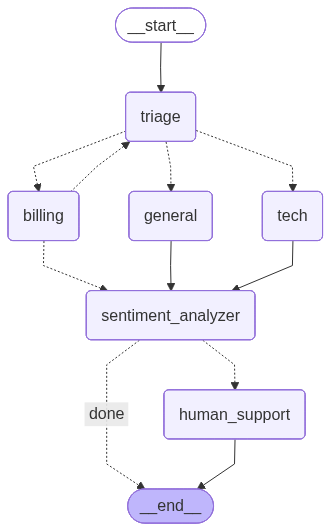

# Agentic AI Support Workflow

A GitHub-ready LangGraph project for a multi-agent customer support workflow. It routes customer messages to specialized agents, uses a mock billing toolset, retrieves technical context from a markdown knowledge base, analyzes sentiment, and pauses for human review when negative sentiment is detected.

## What is included

- LangGraph orchestration for triage, general support, billing, technical support, sentiment analysis, and human review.
- Agent-specific prompts in `src/agentic_ai_project/prompts.py`.
- Mock billing tools in `src/agentic_ai_project/tools.py`.
- RAG over `docs/mock_technical_support_knowledge_base.md` for technical support answers.
- FastAPI app in `src/agentic_ai_project/api.py`.
- Gradio demo UI in `src/agentic_ai_project/gradio_app.py`.
- Original notebook demo moved to `notebooks/agent_workflow_demo.ipynb`.
- Pytest coverage for API behavior and deterministic mock tools.

## Architecture



```text
Customer message
  -> triage
  -> general | billing | tech
  -> sentiment_analyzer
  -> done | human_support interrupt
```

Key modules:

- `graph.py`: builds and compiles the LangGraph state machine.
- `nodes.py`: implements each workflow node and creates the specialized agents.
- `orchestrator.py`: owns graph construction and thread-scoped execution.
- `service.py`: validates inputs and converts raw graph state into API/UI results.
- `api.py`: exposes the workflow through FastAPI.
- `gradio_app.py`: exposes the same workflow through a local chat UI.

## Setup

This project uses Python 3.12 and uv.

```bash
uv sync --dev
cp .env.example .env
```

Set your OpenAI API key in `.env`:

```bash
OPENAI_API_KEY=your_key_here
```

The tests that ship with the project do not call OpenAI. Running the actual workflow does require `OPENAI_API_KEY` because the agents use `ChatOpenAI` and OpenAI embeddings.

## Run the FastAPI app

```bash
uv run uvicorn agentic_ai_project.api:app --reload
```

Open:

- API docs: http://127.0.0.1:8000/docs
- Health check: http://127.0.0.1:8000/health

Example request:

```bash
curl -X POST http://127.0.0.1:8000/chat \
  -H "Content-Type: application/json" \
  -d "{\"message\":\"Our API returns 429. How should we retry?\",\"user_id\":\"u1\"}"
```

If the workflow is interrupted for human review, resume it with:

```bash
curl -X POST http://127.0.0.1:8000/human-review/resume \
  -H "Content-Type: application/json" \
  -d "{\"thread_id\":\"THREAD_ID_FROM_RESPONSE\",\"approved\":true}"
```

To replace the drafted response instead:

```bash
curl -X POST http://127.0.0.1:8000/human-review/resume \
  -H "Content-Type: application/json" \
  -d "{\"thread_id\":\"THREAD_ID_FROM_RESPONSE\",\"approved\":false,\"replacement_message\":\"A human support specialist will take over this case now.\"}"
```

## Run the Gradio UI

```bash
uv run agentic-support
```

The UI uses the same `SupportWorkflowService` as the API.

## Run tests

```bash
uv run pytest
```

Optional lint check:

```bash
uv run ruff check .
```

## Notebook

The exploratory notebook is stored at:

```text
notebooks/agent_workflow_demo.ipynb
```

It shows the original step-by-step development flow for the state, nodes, graph, RAG tool, and demo invocations. The package under `src/agentic_ai_project/` is the maintainable implementation.

## API summary

### `GET /health`

Returns service health.

### `POST /chat`

Request body:

```json
{
  "message": "What can this service do?",
  "user_id": "u1",
  "thread_id": "optional-existing-thread"
}
```

Response includes conversation messages, workflow metadata, and optional interrupt details.

### `POST /human-review/resume`

Request body:

```json
{
  "thread_id": "thread-id",
  "approved": true,
  "replacement_message": ""
}
```

Use this endpoint only after `/chat` returns `interrupted: true`.

## Mock data

Billing tool examples:

- `u1`: active subscription
- `u2`: expired subscription
- `u3`: canceled subscription
- `tx-100`: refundable
- `tx-123`: not refundable
- `tx-200`: refundable

Technical answers are grounded in `docs/mock_technical_support_knowledge_base.md`, a fictional NimbusDesk support knowledge base.
